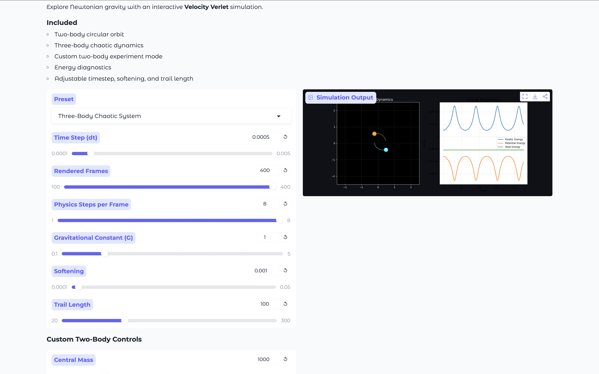
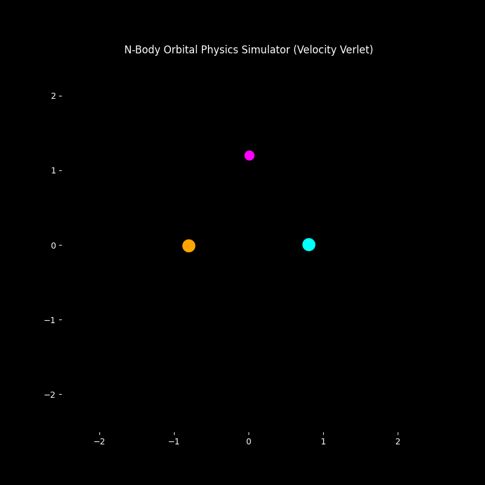

# 🪐 N-Body Orbital Physics Simulator

Interactive computational physics lab for exploring **Newtonian gravity, orbital mechanics, and chaotic multi-body dynamics** using a **Velocity Verlet integrator**.

Live interactive demo:

https://huggingface.co/spaces/dschechter27/N-Body_Orbital_Physics_Lab

---

## Demo





---
## Overview

This project simulates the gravitational motion of multiple bodies interacting through Newton's law of universal gravitation.

Users can experiment with:

• Two-body orbital systems  
• Chaotic three-body dynamics  
• Custom gravitational experiments  
• Energy conservation diagnostics  
• Adjustable numerical simulation parameters  

The engine uses a **Velocity Verlet integrator**, a numerical method commonly used in:

• astrophysics simulations  
• molecular dynamics  
• orbital mechanics  
• particle simulations  

---

# Physics Model

This simulator models the **classical N-body gravitational problem**, where multiple bodies interact through Newtonian gravity.

Each body experiences the combined gravitational force of every other body in the system.

---

# Newton's Law of Gravitation

The gravitational force between two masses is:

$$
F = G \frac{m_i m_j}{r^2}
$$

Where

- $G$ = gravitational constant  
- $m_i, m_j$ = masses of the bodies  
- $r$ = distance between them  

---

# Vector Form of the Force

In the simulation we use the **vector form** of the gravitational force:

$$
\mathbf{F}_{ij} =
G \frac{m_i m_j}{|\mathbf{r}_{ij}|^3}
\mathbf{r}_{ij}
$$

where

$$
\mathbf{r}_{ij} = \mathbf{r}_j - \mathbf{r}_i
$$

This produces both the **correct magnitude and direction** of the force.

---

# From Force to Acceleration

Using Newton's Second Law:

$$
F = ma
$$

we compute acceleration directly:

$$
\mathbf{a}_i =
\sum_{j \ne i}
G \frac{m_j}{|\mathbf{r}_{ij}|^3}
\mathbf{r}_{ij}
$$

Each body accumulates acceleration contributions from **all other bodies**.

---

# Circular Orbit Velocity

For a stable circular orbit, gravitational force must equal centripetal force.

Centripetal force:

$$
F_c = \frac{mv^2}{r}
$$

Gravitational force:

$$
F_g = G \frac{Mm}{r^2}
$$

Setting them equal:

$$
G \frac{Mm}{r^2} = \frac{mv^2}{r}
$$

Solving for orbital velocity:

$$
v = \sqrt{\frac{GM}{r}}
$$

This equation is used to initialize stable circular orbits in the simulation.

---

# Numerical Integration

The motion of bodies is governed by the differential equations:

$$
\frac{d\mathbf{r}}{dt} = \mathbf{v}
$$

$$
\frac{d\mathbf{v}}{dt} = \mathbf{a}
$$

Since computers cannot solve these equations continuously, we approximate them using **numerical integration**.

---

### Velocity Verlet Integrator

This simulator uses the **Velocity Verlet algorithm**, which provides strong numerical stability and good energy conservation for orbital simulations.

**Position update**


**Velocity update**


This method is widely used in:

- astrophysical simulations  
- molecular dynamics  
- orbital mechanics  
- particle simulations

---
# Energy Diagnostics

To verify the simulation is physically correct we track total system energy.

### Kinetic Energy

$$
K = \frac{1}{2}mv^2
$$

### Gravitational Potential Energy

$$
U = - G \frac{m_i m_j}{r_{ij}}
$$

### Total Energy

$$
E = K + U
$$

For a stable physical simulation:

- kinetic and potential energy **oscillate**
- total energy remains **approximately constant**

---

# Three-Body Chaos

Unlike the two-body problem, the **three-body problem has no general analytic solution**.

Small differences in initial conditions lead to dramatically different trajectories.

This simulator demonstrates:

- chaotic orbital motion
- gravitational slingshots
- unstable orbital configurations

---

# Softening Parameter

To prevent numerical instability when bodies pass very close to each other, the simulation uses **gravitational softening**:

$$
r^2 \rightarrow r^2 + \epsilon^2
$$

This prevents singularities when:

$$
r \to 0
$$

---

# Computational Complexity

The naive gravitational calculation evaluates every pair of bodies:

$$
O(N^2)
$$

For large astrophysical simulations, more advanced algorithms are used:

- Barnes–Hut trees
- Fast multipole methods
---

# Implementation Architecture

Core components of the simulation:

### Body class

Stores:

• mass  
• position  
• velocity  
• acceleration  
• visual trail  

---

### Physics engine

Computes:

• pairwise gravitational accelerations  
• velocity updates  
• position updates  

---

### Simulation engine

Controls:

• time stepping  
• integration method  
• physics parameters  

---

### Visualization

Matplotlib is used to render:

• orbital trajectories  
• animated simulations  
• energy diagnostic plots  

---

### Interactive UI

The Hugging Face interface allows users to modify:

• timestep  
• gravitational constant  
• softening parameter  
• number of frames  
• physics steps per frame  
• body masses and velocities  

---

# Repository Structure

```
nbody-orbital-simulator
│
├── physics_engine_lab.ipynb
├── app.py
├── requirements.txt
├── README.md
└── assets
    ├── screenshotlab.png
    └── three_body_demo.gif
```

---

# Technologies Used

- Python  
- NumPy  
- Matplotlib  
- Gradio  
- Hugging Face Spaces  

---

# Author

David Schechter  
Incoming MIT '30  
Interested in physics, machine learning, and computational modeling.
